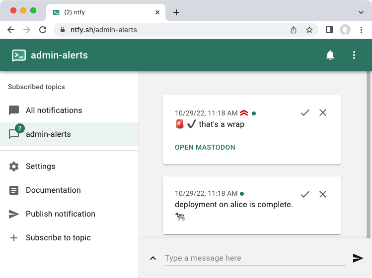

### nfty Ansible action plugin

`nfty` is an Ansible action plugin to post JSON messages to [nfty] and similar HTTP endpoints. The [nfty server][1] is open source.



Consider the following playbook which created the two notifications above:

```yaml
- hosts: alice
  vars:
     topic: "admin-alerts"
  tasks:
    - name: "Notify ntfy that we're done (topic obtained from play var)"
      ntfy:
           msg: "deployment on {{ inventory_hostname }} is complete. 🐄 "

    - name: "different topic"
      ntfy:
            msg: "that's a wrap"
	    topic: "admin-alerts"
            attrs:
               tags: [ rotating_light, heavy_check_mark ]
               priority: 4
               actions:
                  - action: view
                    label: "Open Mastodon"
                    url: "https://mastodon.social/@jpmens"
```

  [nfty]: https://ntfy.sh
  [1]: https://github.com/binwiederhier/ntfy
